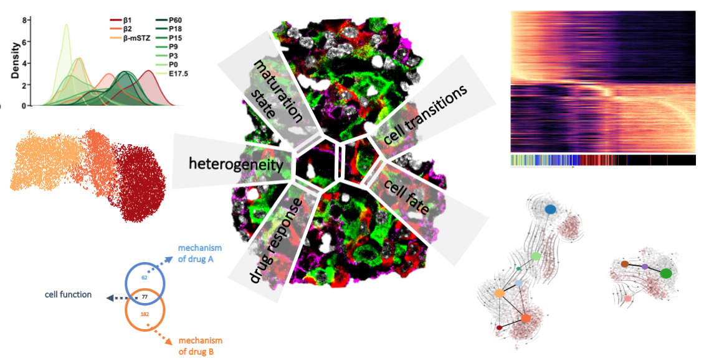

# pancreas-targeted pharmacology of diabetic mSTZ mice

This repository contains all scripts to reproduce the results of the single-cell data from:  
S. Sachs, A. Bastidas-Ponce, S. Tritschler et al., "Targeted pharmacological therapy restores β-cell function for diabetes remission", Nature Metabolism, 2020
doi: 10.1038/s42255-020-0171-3
News & Views by R. Kulkarni: 10.1038/s42255-020-0176-y

The notebooks contain code for the following analyses:
- scRNAseq_preprocessing_clustering.ipynb  -->  QC, preprocessing, clustering and annotation steps (input data are raw count matrices)
- scRNAscRNA_seq_main_analysis.ipynb  -->  main analyses to reproduce all results (input data are preprocessed, filtered and annotated count matrices)
- scRNAseq_RNAvelocity_estimation.ipynb  -->  RNA velocity estimation (input data are preprocessed, filtered and annotated count matrices and bam files to extract splicing information)
- scRNAseq_comparison_b-cell_maturation.ipynb  -->  comparison to postnatal maturation data (Qiu et al, 2017, Cell metabolism, https://doi.org/10.1016/j.cmet.2017.04.003)

The data has been deposited in GEO under accession number GSE132188. The preprocessed, filtered and annotated count matrices are provided as supplementary file as a Anndata object (h5ad-file). 

For further exploration load the adata.h5ad into a cellxgene browser for visualization or into a python-session for additional analyses using scanpy.

Note that most of the analysis was done with scanpy v1.0.4. Some functions have changed in newer versions of scanpy. For other package versions please consult the notebook or the methods in the supplementary information of the manuscript. Numeric results can vary depending on package versions and e.g. affect clustering.

If the materials in this repo are of use to you, please consider citing the above publication.

If you have any questions about the data or analysis feel free to contact us. :)

